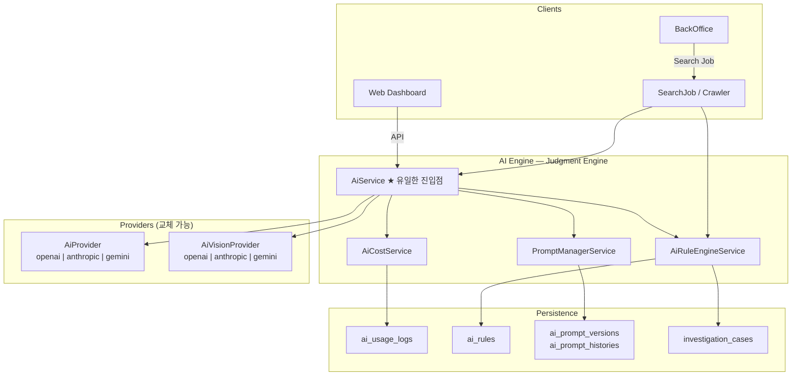
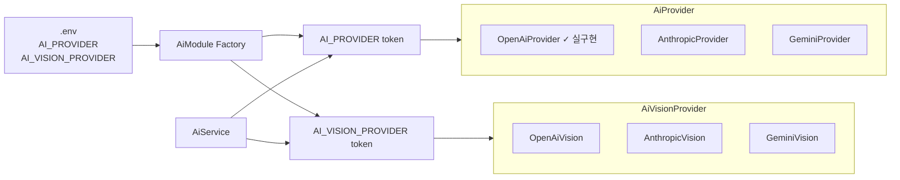
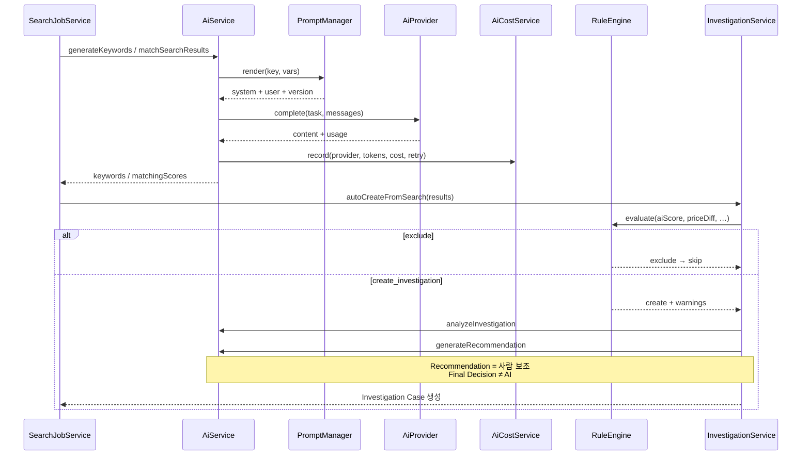
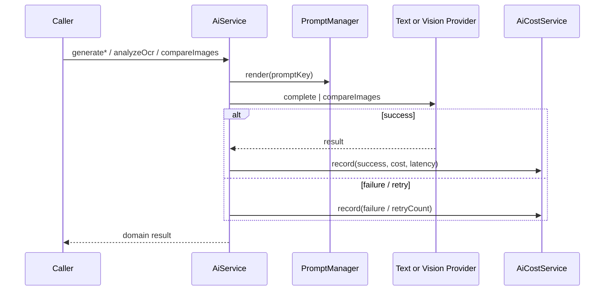
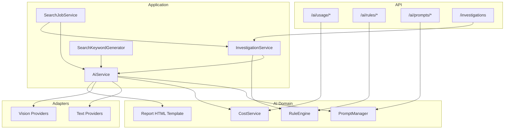

# AI Engine — 다이어그램 · 트리 · 체크리스트 정리

> Search Crawler Server **판단 엔진(Judgment Engine)** 산출물 요약  
> 상세 원칙·API: [`ai_engine_final.md`](./ai_engine_final.md)  
> 작성일: 2026-07-25

---

## 목차

1. [AI Architecture Diagram](#1-ai-architecture-diagram)
2. [Folder Tree](#2-folder-tree)
3. [Prompt Tree](#3-prompt-tree)
4. [Provider Diagram](#4-provider-diagram)
5. [Sequence Diagram](#5-sequence-diagram)
6. [Component Diagram](#6-component-diagram)
7. [Code Review Checklist](#7-code-review-checklist)

---

## 1. AI Architecture Diagram

전체 흐름: Client → **AiService(유일한 진입점)** → Prompt / Rule / Cost → Provider → DB



**원칙 한 줄:** AI 호출은 전부 `AiService`를 통한다. UI는 Provider를 직접 부르지 않는다.

---

## 2. Folder Tree

```
src/ai/
├── ai.module.ts
├── ai.service.ts              # ★ Judgment Engine 진입점
├── ai.principles.ts           # 8대 원칙 상수
├── ai.provider.ts             # Text Provider 계약
├── ai.vision.provider.ts      # Vision Provider 계약
├── ai.types.ts
├── ai.config.ts
├── index.ts
├── README.md
│
├── cost/                      # ⑦ Cost Management
│   ├── ai-cost.pricing.ts
│   ├── ai-cost.types.ts
│   ├── ai-cost.service.ts
│   └── ai-usage.controller.ts
│
├── rules/                     # Rule Engine
│   ├── ai-rule.types.ts
│   ├── default-rules.ts
│   ├── ai-rule-engine.service.ts
│   └── ai-rules.controller.ts
│
├── prompt/                    # ② Prompt Management
│   ├── catalog.ts
│   ├── prompt-manager.service.ts
│   ├── prompt-render.ts
│   ├── prompt.types.ts
│   ├── ai-prompts.controller.ts
│   ├── builders/              # 입력 → vars 만 (본문 없음)
│   └── templates/             # ★ Prompt 본문 (아래 Prompt Tree)
│
├── template/
│   └── report.template.ts     # Report PDF-ready HTML
│
└── providers/                 # ③④ Provider 구현
    ├── openai.provider.ts
    ├── anthropic.provider.ts
    ├── gemini.provider.ts
    ├── openai.vision.provider.ts
    ├── anthropic.vision.provider.ts
    └── gemini.vision.provider.ts
```

---

## 3. Prompt Tree

Prompt 본문은 코드(`.ts`)가 아니라 파일로만 관리한다.

```
src/ai/prompt/templates/
├── keyword/v1/
│   ├── meta.json
│   ├── system.md
│   └── user.md
├── matching/v1/
│   ├── meta.json
│   ├── system.md
│   └── user.md
├── investigation/v1/
│   ├── meta.json
│   ├── system.md
│   └── user.md
├── recommendation/v1/
│   ├── meta.json
│   ├── system.md
│   └── user.md
├── image/v1/
│   ├── meta.json
│   ├── system.md
│   └── user.md
├── ocr/v1/
│   ├── meta.json
│   ├── system.md
│   └── user.md
└── report/v1/
    ├── meta.json
    ├── system.md
    └── user.md
```

| Key | 역할 | 비고 |
|-----|------|------|
| `keyword` | 검색어 생성 | |
| `matching` | 항목 점수 · AI Score | Investigation 생성 입력 |
| `ocr` | OCR 정규화 · 필드 추출 | Text Provider 경로 |
| `image` | 이미지 유사도 | Vision Provider 경로 |
| `investigation` | Summary · 판단 근거 | Recommendation과 분리 |
| `recommendation` | 추천 액션 | **사람 판단 보조** (확정 아님) |
| `report` | JSON + HTML | `suggestedDecision`만 (Human Final Decision 아님) |

관리 API: `GET/PUT /ai/prompts`, `/ai/prompts/:key/history`

---

## 4. Provider Diagram



| 환경변수 | 값 | 설명 |
|----------|-----|------|
| `AI_PROVIDER` | `openai` \| `anthropic` \| `gemini` | Text LLM |
| `AI_VISION_PROVIDER` | 동일 (미설정 시 Text와 동일) | Vision |
| `OPENAI_API_KEY` 등 | 서버 루트 `.env` | UI `web/.env` 사용 금지 |

---

## 5. Sequence Diagram

### 5-A. Search → Matching → Rule → Investigation



### 5-B. Text / OCR / Vision 공통 호출 경로



---

## 6. Component Diagram



---

## 7. Code Review Checklist

### Architecture
- [ ] UI / Controller가 Provider를 **직접** 주입·호출하지 않는가?
- [ ] 신규 AI 기능이 `AiService` 메서드로만 노출되는가?
- [ ] Prompt 본문이 `.ts`가 아니라 `prompt/templates/`에 있는가?
- [ ] `AI_PROVIDER` / `AI_VISION_PROVIDER`로 벤더 전환이 가능한가?

### Pipelines
- [ ] Keyword → Matching → Rule → Investigation 흐름이 맞는가?
- [ ] Investigation Summary와 Recommendation이 **분리**되어 있는가?
- [ ] Report의 `suggestedDecision`이 Human Final Decision을 **대체하지 않는가**?
- [ ] Rule 임계값이 코드 하드코딩이 아니라 DB/Config인가?

### Cost & Ops
- [ ] Text `complete` 성공/실패/재시도가 `ai_usage_logs`에 남는가?
- [ ] Vision 호출도 Cost 기록 경로를 타는가?
- [ ] `/ai/usage/summary`로 오늘·월간·Provider별 조회가 되는가?

### Prompt
- [ ] Prompt 변경 시 version bump + history가 남는가?
- [ ] builders는 vars만 만들고 본문을 쓰지 않는가?

### Security
- [ ] API Key가 서버 `.env`에만 있는가? (`web/.env` 금지)
- [ ] usage log / prompt preview에 불필요한 PII 장기 보관이 없는가?

### 확장 포인트 (의도적 stub)
- [ ] Anthropic / Gemini Text 실구현
- [ ] Vision API 실구현
- [ ] OCR·Vision 점수의 Matching 실데이터 주입
- [ ] Cost / Prompt 관리자 UI

---

## 빠른 참조 — 8대 원칙

| # | 원칙 |
|---|------|
| 1 | 모든 AI 호출은 AI Engine(`AiService`)을 통해 수행 |
| 2 | Prompt는 코드와 분리 (`templates/`) |
| 3 | Provider는 교체 가능 |
| 4 | GPT · Claude · Gemini를 env로 전환 |
| 5 | Investigation은 AI 결과 기반 생성 |
| 6 | Recommendation은 사람 최종 판단 **보조** |
| 7 | AI 호출 로그·비용 기록 |
| 8 | Vision · OCR · Text 동일 구조 |

---

*다음 STEP은 진행하지 않음 · AI FINAL STEP 산출물*
