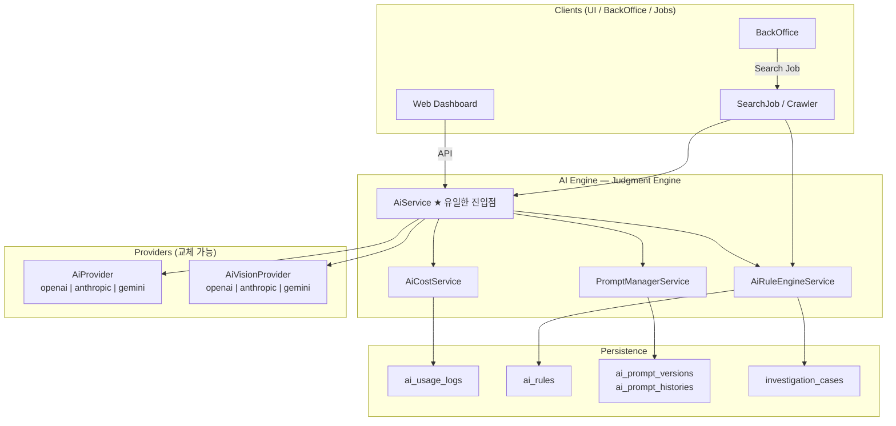
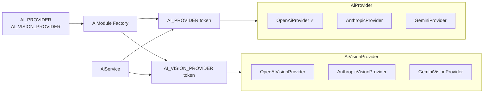
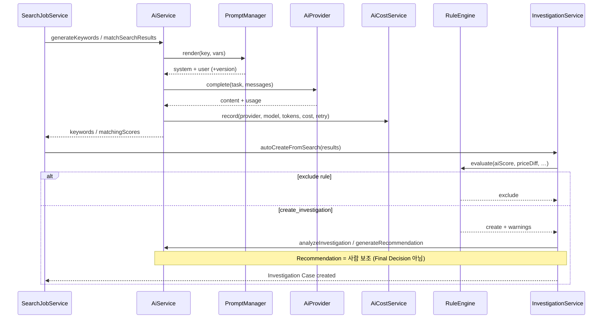
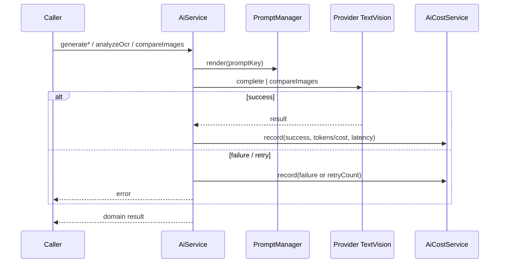
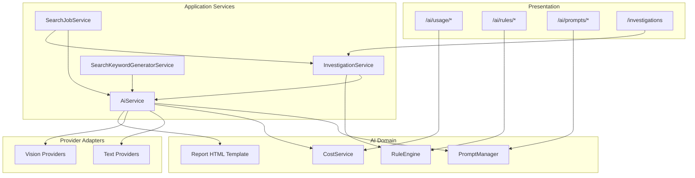

# AI Engine — FINAL Architecture

> **AI는 단순 채팅 기능이 아니다.**  
> Search Crawler Server의 **판단 엔진(Judgment Engine)** 이다.

다음 STEP은 진행하지 않는다. 본 문서는 AI FINAL STEP 산출물이다.

---

## Principles (필수)

| # | 원칙 | 구현 |
|---|------|------|
| 1 | 모든 AI 호출은 AI Engine을 통해 수행 | `AiService` 만 진입점. Provider 직접 주입 금지 |
| 2 | Prompt는 코드와 분리 | `prompt/templates/{key}/v{n}/*.md` + `PromptManagerService` |
| 3 | Provider는 교체 가능 | `AiProvider` / `AiVisionProvider` 인터페이스 |
| 4 | GPT · Claude · Gemini 전환 | `AI_PROVIDER` / `AI_VISION_PROVIDER` |
| 5 | Investigation은 AI 결과 기반 | Matching → Rule Engine → autoCreate |
| 6 | Recommendation은 사람 판단 보조 | Summary ≠ Recommendation ≠ Human Final Decision |
| 7 | 호출 로그·비용 기록 | `AiCostService` + `ai_usage_logs` |
| 8 | Vision · OCR · Text 동일 구조 | Prompt → AiService → Provider → Cost |

코드 상수: `src/ai/ai.principles.ts`

---

## AI Architecture Diagram



---

## Folder Tree

```
src/ai/
├── ai.module.ts
├── ai.service.ts              # ★ Judgment Engine 진입점
├── ai.principles.ts           # FINAL 원칙 상수
├── ai.provider.ts             # Text Provider 계약
├── ai.vision.provider.ts      # Vision Provider 계약
├── ai.types.ts
├── ai.config.ts
├── index.ts
├── cost/                      # Cost Management
│   ├── ai-cost.pricing.ts
│   ├── ai-cost.types.ts
│   ├── ai-cost.service.ts
│   └── ai-usage.controller.ts
├── rules/                     # Rule Engine
│   ├── ai-rule.types.ts
│   ├── default-rules.ts
│   ├── ai-rule-engine.service.ts
│   └── ai-rules.controller.ts
├── prompt/                    # Prompt Management
│   ├── catalog.ts
│   ├── prompt-manager.service.ts
│   ├── prompt-render.ts
│   ├── prompt.types.ts
│   ├── ai-prompts.controller.ts
│   ├── builders/              # 입력 → vars 만 (본문 없음)
│   └── templates/             # ★ Prompt 본문
├── template/
│   └── report.template.ts     # PDF-ready HTML
└── providers/
    ├── openai.provider.ts
    ├── anthropic.provider.ts
    ├── gemini.provider.ts
    ├── openai.vision.provider.ts
    ├── anthropic.vision.provider.ts
    └── gemini.vision.provider.ts
```

---

## Prompt Tree

```
src/ai/prompt/templates/
├── keyword/v1/{meta.json, system.md, user.md}
├── matching/v1/{meta.json, system.md, user.md}
├── investigation/v1/{meta.json, system.md, user.md}
├── recommendation/v1/{meta.json, system.md, user.md}
├── image/v1/{meta.json, system.md, user.md}
├── ocr/v1/{meta.json, system.md, user.md}
└── report/v1/{meta.json, system.md, user.md}
```

| Key | Pipeline | 역할 |
|-----|----------|------|
| keyword | Keyword Generator | 검색어 생성 |
| matching | Matching Engine | 항목 점수 · AI Score |
| ocr | OCR Analysis | 텍스트 정규화 · 필드 추출 |
| image | Vision | 이미지 유사도 |
| investigation | Investigation Analysis | Summary · 판단 근거 |
| recommendation | Recommendation | 사람 보조 액션 (확정 아님) |
| report | Report Generator | JSON+HTML · **suggestedDecision** |

관리자 API: `GET/PUT /ai/prompts`, `/history`, `/versions`

---

## Provider Diagram



전환:

```env
AI_PROVIDER=openai|anthropic|gemini
AI_VISION_PROVIDER=openai|anthropic|gemini
OPENAI_API_KEY=
ANTHROPIC_API_KEY=
GEMINI_API_KEY=
```

> OpenAI Text 는 실구현. Anthropic/Gemini Text · 전 Vision 은 Interface 유지(스왑 가능, 구현 확장 포인트).

---

## Sequence Diagram

### A. Search Job → Investigation (판단 파이프라인)



### B. Unified call path (Text / OCR / Vision)



---

## Component Diagram



---

## Judgment vs Chat

| 구분 | Chat Bot | AI Engine (본 시스템) |
|------|----------|----------------------|
| 목적 | 대화 | 재판매 탐지 **판단** |
| 진입점 | 임의 | `AiService` only |
| 출력 | 자유 텍스트 | 구조화 Score · Rule · Case |
| 최종 권한 | 모델 | **사람 Final Decision** |
| 비용 | 무시 가능 | **필수 기록** |

---

## Code Review Checklist

### Architecture
- [ ] UI / Controller 가 Provider 를 직접 주입·호출하지 않는가?
- [ ] 신규 AI 기능이 `AiService` 메서드로만 노출되는가?
- [ ] Prompt 본문이 `.ts` 문자열에 하드코딩되지 않고 `templates/` 에 있는가?
- [ ] `AI_PROVIDER` / `AI_VISION_PROVIDER` 로 벤더 전환이 가능한가?

### Pipelines
- [ ] Keyword → Matching → (OCR/Vision) → Rule → Investigation 순서가 문서와 일치하는가?
- [ ] Investigation Summary 와 Recommendation 이 분리되어 있는가?
- [ ] Report 의 `suggestedDecision` 이 Human Final Decision 을 대체하지 않는가?
- [ ] Rule 임계값이 코드 if 문이 아니라 DB/Config Rule 인가?

### Cost & Ops
- [ ] Text `complete` 성공/실패/재시도가 `ai_usage_logs` 에 남는가?
- [ ] Vision 호출도 Cost 기록 경로를 타는가?
- [ ] Dashboard API (`/ai/usage/summary`) 로 오늘·월간·Provider별 조회가 되는가?

### Prompt Management
- [ ] Prompt 변경 시 version bump + history 가 남는가?
- [ ] `{{var}}` / `{{payload}}` 렌더만 builders 가 담당하는가?

### Security
- [ ] API Key 가 `web/.env` 가 아닌 서버 `.env` 에만 있는가?
- [ ] Prompt preview / usage log 에 과도한 PII 가 장기 보관되지 않는가?

### Known Extension Points (의도적 stub)
- [ ] Anthropic / Gemini Text 실구현
- [ ] Vision Provider 실구현 (현재 Interface + cost 경로)
- [ ] OCR/Vision 결과를 Matching 점수에 실데이터로 주입
- [ ] Cost / Prompt 관리자 UI

---

## API Surface (관리·관측)

| Method | Path | 용도 |
|--------|------|------|
| GET | `/ai/usage/summary` | 오늘 · 월간 · Provider별 |
| GET | `/ai/rules` | Rule 목록 |
| GET | `/ai/prompts` | Prompt Tree |
| PUT | `/ai/prompts/:key` | Prompt 수정 (+ History) |

---

*AI FINAL STEP · 2026-07-25*
